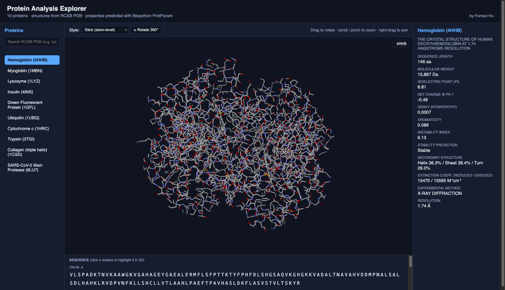
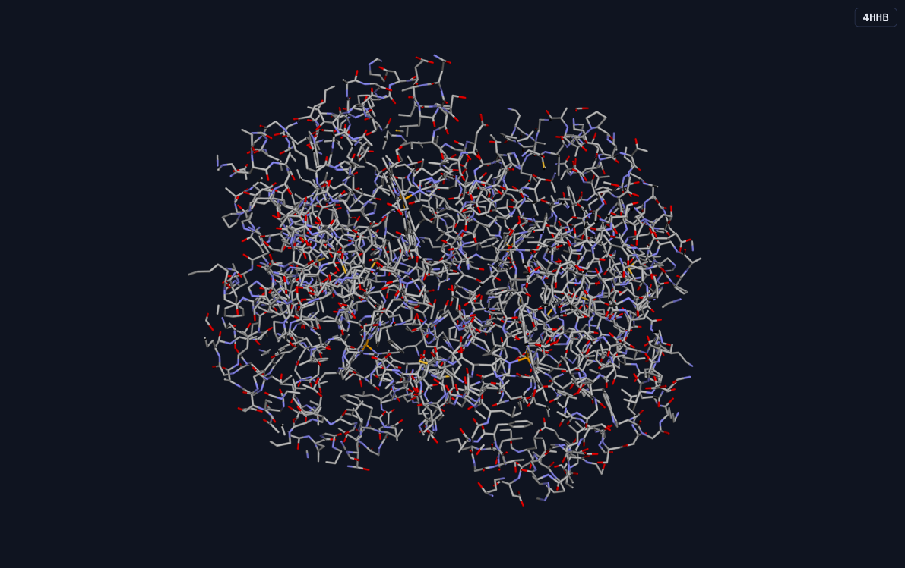

# Protein Analysis Explorer

An end-to-end pipeline that pulls real protein structures from an open data
source, renders them in an interactive atom-level 3D viewer, and predicts
physicochemical properties for each one.

## Screenshots





## Proteins analyzed

10 well-known, structurally diverse proteins fetched from the
[RCSB Protein Data Bank](https://www.rcsb.org/) (open, no API key required):

| PDB ID | Protein                     | Role                                            |
|--------|------------------------------|--------------------------------------------------|
| 4HHB   | Hemoglobin                  | Oxygen transport                                  |
| 1MBN   | Myoglobin                   | Oxygen storage                                    |
| 1LYZ   | Lysozyme                    | Antibacterial enzyme                              |
| 4INS   | Insulin                     | Blood glucose regulation hormone                  |
| 1GFL   | Green Fluorescent Protein   | Fluorescent marker                                |
| 1UBQ   | Ubiquitin                   | Protein degradation tagging                       |
| 1HRC   | Cytochrome c                | Electron transport in mitochondria                |
| 3TGI   | Trypsin                     | Digestive protease                                |
| 1CGD   | Collagen (triple helix)     | Structural/connective tissue protein              |
| 6LU7   | SARS-CoV-2 Main Protease    | Viral replication enzyme, drug target             |

See [scripts/proteins.py](scripts/proteins.py) to change the protein list.

## Architecture

1. **Data fetch** ([scripts/fetch_data.py](scripts/fetch_data.py)) — downloads
   `.pdb` structure files, FASTA sequences, and entry metadata (title,
   resolution, experimental method) from RCSB into `data/`.
2. **Property prediction** ([scripts/compute_properties.py](scripts/compute_properties.py)) —
   uses Biopython's `ProteinAnalysis` (ProtParam) on each sequence to
   predict: molecular weight, isoelectric point, net charge at pH 7,
   instability index (+ stability call), aromaticity, GRAVY (hydropathy),
   secondary-structure fraction (helix/sheet/turn), extinction coefficient,
   and amino-acid composition. Results are cached in `data/properties.json`.
3. **Web app** ([app.py](app.py)) — a small Flask server exposing:
   - `GET /` — the viewer page
   - `GET /api/proteins` — protein metadata list
   - `GET /api/properties` — computed properties keyed by PDB ID
   - `GET /data/structures/<id>.pdb` — raw structure file for the 3D viewer
4. **3D viewer** ([templates/index.html](templates/index.html), [static/js/viewer.js](static/js/viewer.js)) —
   uses [3Dmol.js](https://3dmol.org/) to render each structure at atom level
   (stick/sphere/line/cartoon styles). Rotation (drag), zoom (scroll/pinch),
   and pan (right-drag) are handled natively by 3Dmol.js.

## Setup & run

```bash
python3 -m venv .venv
source .venv/bin/activate
pip install -r requirements.txt

# 1. Pull protein data from RCSB PDB
python scripts/fetch_data.py

# 2. Predict properties from the fetched sequences
python scripts/compute_properties.py

# 3. Launch the viewer
python app.py
```

Then open http://127.0.0.1:8000 in a browser. Pick a protein from the left
sidebar, choose a render style, and drag/scroll on the 3D view to
rotate/zoom. Predicted properties appear in the right-hand panel.

## Notes

- Re-run `fetch_data.py` any time to refresh cached data or after editing
  `scripts/proteins.py` to analyze different proteins.
- Property predictions are sequence-based (ProtParam), a standard approach
  for estimating physicochemical characteristics without running expensive
  simulations.
